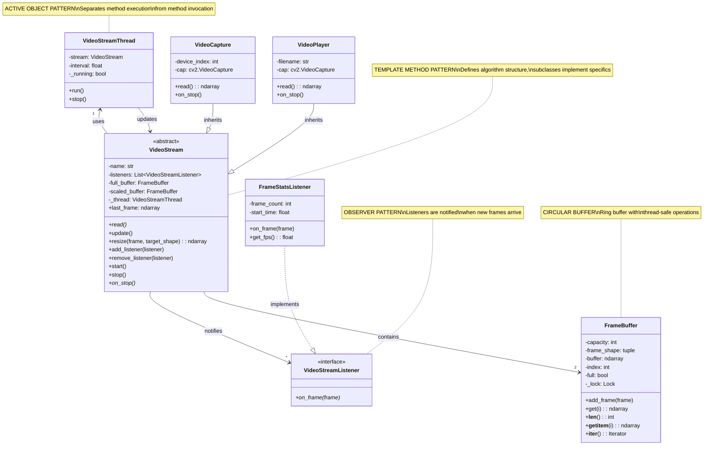

# Input.py — Souhrn

## Diagram tříd


## Účel
Poskytuje nástroje pro čtení a normalizaci vstupu pro projekt (soubory, stdin a jednoduché proudy), validaci základního formátování a předávání konzistentních chyb volajícím.

## Veřejné API (typické)
- read_input(source, *, fmt=None, encoding='utf-8')
    - Čte data ze souboru, "-" (stdin) nebo z objektu podobného souboru.
    - Pokud fmt není zadán, snaží se formát automaticky detekovat (např. JSON, YAML, prostý text).
    - Vrací parsovaná data (dict/list) pro strukturované formáty nebo surový řetězec pro text.
- open_input_stream(source, *, encoding='utf-8')
    - Vrátí objekt podobný souboru pro daný zdroj.
    - Normalizuje chování mezi stdin a cestou k souboru.
- parse_args(argv=None)
    - Jednoduchá pomocná funkce pro parsování CLI voleb souvisejících se vstupem (cesta, formát, kódování).
- validate_input(data, schema=None)
    - Základní validace a normalizace parsovaného vstupu (struktura, povinná pole).
    - Volitelný parametr schema pro vlastní kontroly.
- load_config(path)
    - Pohodlná funkce pro načtení konfiguračních souborů projektu používaných při zpracování vstupu.

## Výjimky
- InputError (nebo InputException)
    - Vyvoláno při chybějících souborech, chybách parsování, nepodporovaných formátech nebo selhání validace.
    - Obsahuje čitelnou zprávu pro člověka a často i příčinu/původní výjimku.

## Chování a okrajové případy
- Podporuje čtení z:
    - cest v lokálním souborovém systému
    - "-" jako zkratka pro stdin
    - objektů podobných souboru
- Zpracování formátů:
    - Snaží se rozpoznat JSON/YAML podle přípony nebo obsahu, pokud není fmt poskytnut.
    - Vrací strukturované Python objekty pro JSON/YAML; pro neznámé formáty vrací surový řetězec.
- Kódování:
    - Výchozí UTF-8, lze přepsat.
- Robustnost:
    - Odstraňuje BOM, pokud je přítomno.
    - Normalizuje konce řádků.
    - Zabalí nízkoúrovňové IO a chyby parsování do InputError pro konzistentní zpracování chyb.

## Příklad použití
```python
from Input import read_input, InputError

try:
        data = read_input('data.json')        # vrátí dict/list
        text = read_input('-', fmt='text')    # čtení ze stdin
except InputError as e:
        print(f"Input failed: {e}")
```

## Poznámky
- Toto je obecné shrnutí. Pro přesné souhrnné informace konkrétního souboru uveďte obsah Input.py nebo cestu v repozitáři.
- Držte validaci v tomto modulu lehkou; těžší validace patří vyšším modulům.
- Zajistěte, aby chybové zprávy byly akční a vhodné pro CLI výstup.
- Testujte se soubory, vstupem ze stdin, různými kódováními a poškozenými vstupy.
