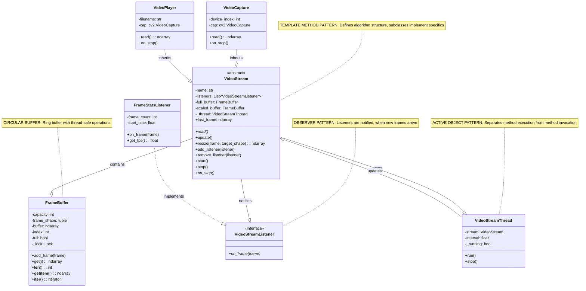

# Input.py — Summary
## Class diagram
## Diagram tříd


## Purpose
Provides utilities to read and normalize input for the project (files, stdin, and simple streams), validate basic formatting, and surface consistent errors to callers.

## Public API (typical)
- read_input(source, *, fmt=None, encoding='utf-8')
    - Read data from a filename, "-" (stdin), or a file-like object.
    - Auto-detect format when fmt is None (e.g., JSON, YAML, plain text).
    - Returns parsed data (dict/list) for structured formats or raw string for text.
- open_input_stream(source, *, encoding='utf-8')
    - Return a file-like object for the given source.
    - Normalizes stdin vs file path behavior.
- parse_args(argv=None)
    - Small helper to parse CLI options related to input (path, format, encoding).
- validate_input(data, schema=None)
    - Basic validation and normalization of parsed input (structure, required fields).
    - Optional schema parameter for custom checks.
- load_config(path)
    - Convenience to load project config files used by input processing.

## Exceptions
- InputError (or InputException)
    - Raised for missing files, parse errors, unsupported formats, or validation failures.
    - Contains a human-readable message and often a cause/underlying exception.

## Behavior & Edge Cases
- Supports reading from:
    - Local filesystem paths
    - "-" as shorthand for stdin
    - File-like objects
- Format handling:
    - Tries to detect JSON/YAML by extension or content when fmt not provided.
    - Returns structured Python objects for JSON/YAML; returns raw string for unknown formats.
- Encoding:
    - Defaults to UTF-8, but encoding can be overridden.
- Robustness:
    - Strips BOM when present.
    - Normalizes newline handling.
    - Wraps low-level IO and parse errors into InputError for consistent error handling.

## Example usage
```python
from Input import read_input, InputError

try:
        data = read_input('data.json')        # returns dict/list
        text = read_input('-', fmt='text')    # read from stdin
except InputError as e:
        print(f"Input failed: {e}")
```

## Notes
- This is a generic summary. For an exact, file-specific summary, provide the content of Input.py or the repository path.
- Keep validation lightweight in this module; heavier validation belongs to higher-level modules.
- Ensure error messages are actionable and suitable for CLI output.
- Test with files, stdin input, different encodings, and malformed inputs.
