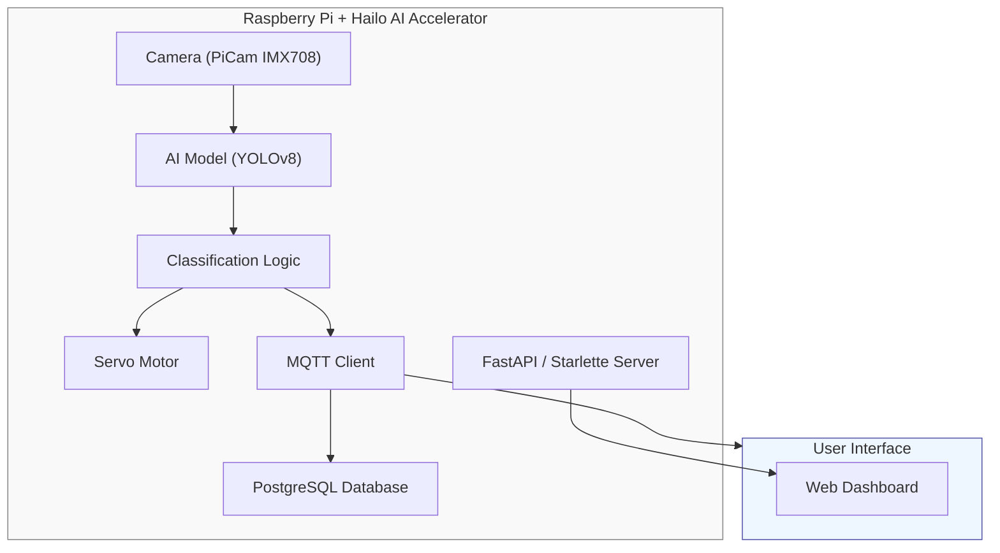

[](https://www.python.org/)
[](https://github.com/ultralytics/ultralytics)
[](https://fastapi.tiangolo.com/)
[](https://www.raspberrypi.com/)
[](https://hailo.ai/)
[](https://www.postgresql.org/)
[](https://www.docker.com/)
[](./LICENSE)

# Real-time Object Analysis, Classification, and Sorting System
A prototype system for **real-time object detection, classification, and physical sorting** using a Raspberry Pi 5 with a Hailo AI hardware accelerator. The system captures a live camera feed, runs AI inference, physically controls a servo motor based on classification results, and visualizes all data through a live web dashboard.

## Project Goals
The goal is to **create a prototype system** that can:
- Analyze real-time camera feed
- Recognize and classify objects (e.g., apples, potatoes, packages)
- **Control hardware for physical sorting** based on classification (servo, actuators)
- **Record and visualize sorting data** through a web interface

The system is implemented on **Raspberry Pi** with an **AI accelerator** (Hailo AI Kit) and camera (IMX708).

## System Architecture


### Data Flow
1. **Camera** captures objects in real-time
2. **AI model** performs detection and classification
3. **Decision logic** evaluates results and sends signals to servo
4. **Servo motor** physically sorts objects (e.g., right = good, left = defective)
5. **Logger** sends results (time, object type, outcome) via WebSocket/MQTT and stores in database
6. **FastAPI server** provides web interface for statistics and live video

## Project Structure
#### Basic structure
```
PS_Project/
├── docs/       # Project documentation and other documents
│
├── pc_src/     # PC-side source codes (development & training)
│   │
│   ├── yolov8n_src/            # YOLOv8 nano — early prototype pipeline
│   │
│   └── yolov11l_src/           # YOLOv11 large — PC GPU production pipeline
│
├── rpi_src/    # Raspberry Pi source codes (embedded device)
│   │
│   ├── model_compilation/      # Model compilation files for hailo
│   │
│   ├── rpi_starlette_src/      # Starlette-based async API on RPi
│   │
│   ├── rpi_streamlit_src/      # Streamlit-based dashboard version on RPi
│   │
│   └── rpi_testing_scripts/    # Standalone hardware & integration test scripts
├── testing_videos/     # Sample recordings with statistics 
├── LICENSE             # Project license
└── README.md           # Official Readme           
```

#### More detailed structure
```
PS_Project/
├── docs/       # Project documentation and other documents
│   ├── PROPOSAL.md                # Project proposal (English)
│   ├── NAVRH.md                   # Project proposal (Czech)
│   └── dashboard_diagram.md       # Web dashboard architecture diagram
│
├── pc_src/     # PC-side source codes (development & training)
│   │
│   ├── yolov8n_src/               # YOLOv8 nano — early prototype pipeline
│   │   ├── final_pipeline.py      # Main detection pipeline
│   │   ├── models/                # Model config files (YOLOv3 cfg, COCO names)
│   │   └── output/                # Detection output frames (webcam, dataset, YouTube)
│   │
│   └── yolov11l_src/                             # YOLOv11 large — PC GPU production pipeline
│       ├── yoloTrafficDetectionSystem_PC_GPU.py  # Main GPU detection system
│       ├── client_API.py                         # FastAPI server for PC-side endpoints
│       ├── DatabaseManagerPostgre.py             # PostgreSQL database manager
│       ├── MQTTClient.py                         # MQTT communication client
│       ├── Dockerfile                            # Docker container for PC deployment
│       └── requirements.txt                      # Python dependencies
│
├── rpi_src/    # Raspberry Pi source codes (embedded device)
│   │
│   ├── model_compilation/      # Model compilation for hailo
│   │   ├── calib_dataset           # Dataset images from camera converted to jpg
│   │   ├── calib_dataset_npy       # Dataset images from camera in .npy format
│   │   ├── coco_full               # Coco images dataset
│   │   ├── model_compilation.ipynb # Hailo model compilation notebook
│   │   ├── model_export.py         # Model export to ONNX / HEF format
│   │   └── yolov8s.hef             # Compiled Hailo HEF model binary
│   │
│   ├── rpi_starlette_src/      # Starlette-based async API on RPi
│   │   ├── api_integration.py      # Main API integration layer
│   │   ├── RemoteUtils.py          # Remote deployment & management utilities
│   │   ├── DeployRemoteUtils.bat   # Windows batch script for remote deploy
│   │   └── Pipeline/               # Hailo AI inference pipeline
│   │       ├── HailoPipeline.py    # Core Hailo accelerator pipeline
│   │       ├── mqtt_spy.py         # MQTT monitoring/debug utility
│   │       ├── pipeline_test.py    # Pipeline unit tests
│   │       └── test.py             # Integration test script
│   │
│   ├── rpi_streamlit_src/      # Streamlit-based dashboard version on RPi
│   │   ├── API_with_streamlit.py               # Combined API + Streamlit dashboard
│   │   ├── DetectionWithGStreamer_pipeline.py  # GStreamer-based video pipeline
│   │   ├── ServoControl.py                     # Servo motor GPIO control
│   │   ├── DatabaseManagerPostgre.py           # PostgreSQL integration
│   │   ├── MQTTClient.py                       # MQTT client for RPi
│   │   ├── WebSocket.py                        # WebSocket server for live streaming
│   │   └── init_hailo.sql                      # Database schema initialization
│   │
│   └── rpi_testing_scripts/    # Standalone hardware & integration test scripts
│       ├── OnboardCameraTest.py                # PiCam IMX708 functionality test
│       ├── GStreamer_RTSP_stream_test.py       # RTSP stream connectivity test
│       ├── ServoController.py                  # Servo controller class
│       ├── ServoControl.py                     # Servo GPIO test script
│       ├── test_gpio18.py                      # GPIO pin 18 / servo signal test
│       └── test.py                             # General hardware integration test
│
├── testing_videos/     # Sample recordings with statistics 
├── LICENSE             # Project license
└── README.md           # Official Readme           
```

## Technology Stack
| Domain | Technologies |
|---|---|
| **AI / ML** | YOLOv8, YOLOv11, ONNX, Hailo HEF, PiCamera2 |
| **Embedded** | Raspberry Pi 5, GPIO (lgpio), IMX708 Camera, GStreamer |
| **Backend** | FastAPI, Starlette, Python 3.10+, MQTT |
| **Frontend** | HTML / CSS / JavaScript |
| **Database** | PostgreSQL |
| **DevOps** | Docker, Git, Bash |
| **Protocols** | WebSocket, RTSP, MQTT, REST |

## API Overview (FastAPI)
| Endpoint | Method | Description |
|---|---|---|
| `/servo/move` | POST | Control servo position and speed |
| `/camera/stream/capture` | GET | Capture a single photo |
| `/camera/stream/snapshots` | GET | Live MJPEG video stream |
| `/api/detections` | GET | Retrieve recent detection results |
| `/api/statistics` | GET | Aggregated classification statistics |
| `/ws/ai` | WebSocket | Real-time detection event stream |
| `/health/ai` | GET | AI pipeline health check |
| `/health/camera` | GET | Camera health check |

## Team Roles
| Name | Role | Responsibilities |
|---|---|---|
| Member 1 | AI / Computer Vision | Model research, dataset collection, YOLOv8/v11 training, Hailo optimization |
| Member 2 | Embedded & Hardware | Raspberry Pi setup, GPIO, servo/camera wiring, GStreamer pipeline, latency optimization |
| Member 3 | Software & Visualization | FastAPI/Starlette server, Streamlit dashboard, PostgreSQL, WebSocket, documentation |

## Development Timeline (Overview)
| Week | Activity |
|---|---|
| 1–2 | Research, architecture design, component selection |
| 3–5 | Dataset collection, annotation, model training |
| 6–7 | Backend development (FastAPI, WebSocket, database) |
| 8–9 | Raspberry Pi integration, servo control, hardware testing |
| 10 | System testing, performance optimization |
| 11 | Documentation, final presentation preparation |

## Testing and Evaluation
- **Camera tests** — PiCam IMX708 capture quality and FPS (`OnboardCameraTest.py`)
- **GPIO / Servo tests** — Signal accuracy and response time (`test_gpio18.py`, `ServoControl.py`)
- **Stream tests** — RTSP and GStreamer connectivity (`GStreamer_RTSP_stream_test.py`)
- **AI pipeline tests** — Inference accuracy, latency, FPS (`pipeline_test.py`)
- **Model metrics** — classification accuracy
- **Sorting reliability** — Percentage of correctly sorted objects end-to-end

## Deliverables
- Functional **prototype sorting device** with live camera, AI inference, and servo control
- **Web dashboard** for real-time detection visualization and statistics
- **Trained model** in ONNX and Hailo HEF format
- **Dataset** with training images
- **Final technical report** and project documentation
 
## Contributing
his project was developed as part of a university course demonstrating modern computer vision, machine learning, and embedded systems integration.
 
If you'd like to build on it, feel free to fork the repository and open a pull request. For questions or suggestions, open an issue.

<p align="center">
  Made with ❤️ using Raspberry Pi 5 · Hailo AI · YOLOv8 · FastAPI
</p>