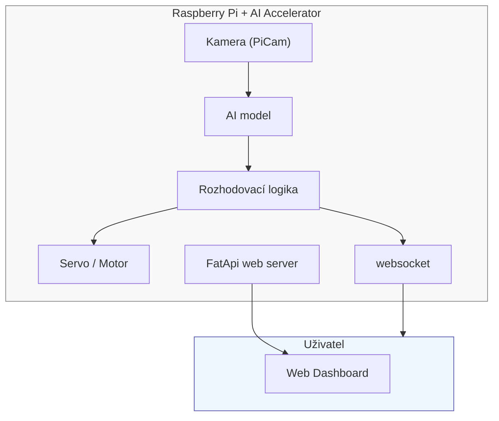

# Real-time Object Analysis, Classification, and Sorting System 
**(Systém pro analýzu, klasifikaci a třídění objektů v reálném čase)**

## Cíl projektu
Cílem projektu je **vytvořit prototyp systému**, který dokáže v reálném čase:
- analyzovat obraz z kamery,
- rozpoznat a klasifikovat objekty (např. jablka, brambory, obaly),
- na základě klasifikace **ovládat hardware pro fyzické třídění** (např. servo, páka),
- a zároveň **zaznamenávat a vizualizovat data o třídění** ve webovém rozhraní.

Systém bude implementován na **Raspberry Pi** s připojeným **AI akcelerátorem** (např. Google Coral USB Accelerator) a kamerou.

## Architektura systému

### Přehled komponent

### Datový tok
1. **Kamera** snímá objekt v reálném čase.  
2. **AI model** provede detekci a klasifikaci.  
3. **Rozhodovací logika** vyhodnotí výsledek a vyšle signál servu.  
4. **Servo motor** fyzicky třídí objekt (např. doprava = dobrý kus, doleva = vadný).  
5. **Logger** Posílá výsledky (čas, typ objektu, výsledek) pře WS a ukládá je do db  
6. **FastApi server** poskytuje webové rozhraní pro zobrazení statistik a živého videa.

## Rozdělení rolí v týmu

### 1. AI / Computer Vision Inženýr
**Zodpovědnosti:**
- Rešerše metod detekce a klasifikace.
- Sběr a příprava datové sady (fotky objektů, anotace).
- Trénink a optimalizace modelu pro Raspberry Pi (Hailo).
- Testování přesnosti modelu.

**Technologie:**
- Python  
- PiCamera2  
- ONNX + Hailo, yolov8

---

### 2. Embedded & Hardware Inženýr
**Zodpovědnosti:**
- Konfigurace Raspberry Pi (OS, kamera, GPIO).
- Připojení a programování servomotorů, snímačů a kamery.
- Implementace komunikační logiky mezi AI modulem a hardwarem.
- Optimalizace pro běh v reálném čase (nižší latence, vyšší FPS).

**Technologie:**
- Python (RPi.GPIO / gpiozero)  
- Raspberry Pi OS
- rpicam  
- Bash / Docker (volitelné)

### 3. Software & Data Visualization Vývojář
**Zodpovědnosti:**
- Vývoj webového rozhraní (Bootstrap / Chart.js).
- Implementace REST API pro přístup k výsledkům klasifikace.
- Ukládání a vizualizace dat (WebSocket, SQLite, PostgreSQL).
- Dokumentace a prezentace výsledků.

**Technologie:**
- Python, FastAPI  
- HTML, CSS, JavaScript (Bootstrap, Chart.js)  
- SQLite / PostgreSQL / WebSocket  
- Git, Markdown, Docker

## Modulová struktura projektu
```
project/
├── ai_model/
│   ├── train_model.ipynb        # Trénování modelu
│   ├── model.tflite             # Optimalizovaný model
│   └── dataset/                 # Data pro trénink
│
├── hardware/
│   ├── servo_controller.py      # Ovládání motorů
│   ├── camera_stream.py         # Práce s kamerou
│   └── gpio_setup.py            # Nastavení GPIO pinů
│
├── web/
│   ├── app.py                   # Flask backend
│   ├── static/                  # CSS, JS, grafy
│   └── templates/               # HTML šablony
│
├── data/
│   ├── results.csv              # Log detekovaných objektů
│   └── stats.db                 # Databáze výsledků
│
└── docs/
    ├── architecture_diagram.png # Architektura systému
    └── README.md                # Dokumentace projektu
```

## Testování a evaluace
- **Funkční testy** – klasifikace objektů v reálném čase.  
- **Výkonnostní testy** – měření FPS, latence a odezvy systému.  
- **Přesnost modelu** – Confusion Matrix, F1-score, přesnost klasifikace.  
- **Spolehlivost třídění** – procento správně roztříděných objektů.

## Výstupy projektu
- Funkční **prototyp třídicího zařízení** s kamerou a servem.  
- **Webové rozhraní** pro vizualizaci dat o klasifikaci.  
- **Dataset + natrénovaný model**.  
- **Závěrečná zpráva** a **technická dokumentace** systému.

## Použité technologie
| Oblast   | Technologie                               |
| -------- | ----------------------------------------- |
| AI / ML  | ONNX, HAILO, YOLOv8m, PiCamera2           |
| Embedded | Raspberry Pi, GPIO, IMX708 camera         |
| Backend  | FastApi, Python                           |
| Frontend | HTML, CSS, Bootstrap, Chart.js            |
| Databáze | SQLite / PostgreSQL                       |
| Ostatní  | Git, Docker, Markdown                     |

## Návrh časového plánu (přehledově)
| Týden | Aktivita                                 |
| ----- | ---------------------------------------- |
| 1–2   | Rešerše, návrh architektury              |
| 3–5   | Sběr dat, trénink modelu                 |
| 6–7   | Vývoj softwaru (FastApi, vizualizace) ;  |
| 8–9   | Integrace s Raspberry Pi a hardwarem     |
| 10    | Testování a ladění                       |
| 11    | Dokumentace a příprava prezentace        |

## Autoři projektu
| Jméno    | Role             | Zodpovědnost                        |
| -------- | ---------------- | ----------------------------------- |
| [Člen 1] | AI inženýr       | Vývoj modelu a datová analýza       |
| [Člen 2] | Embedded vývojář | Raspberry Pi, servo, kamera         |
| [Člen 3] | Software vývojář | Web, API, vizualizace a dokumentace |

*Projekt vznikl v rámci univerzitního kurzu jako demonstrační prototyp využívající moderní metody počítačového vidění, strojového učení a embedded systémů.*
