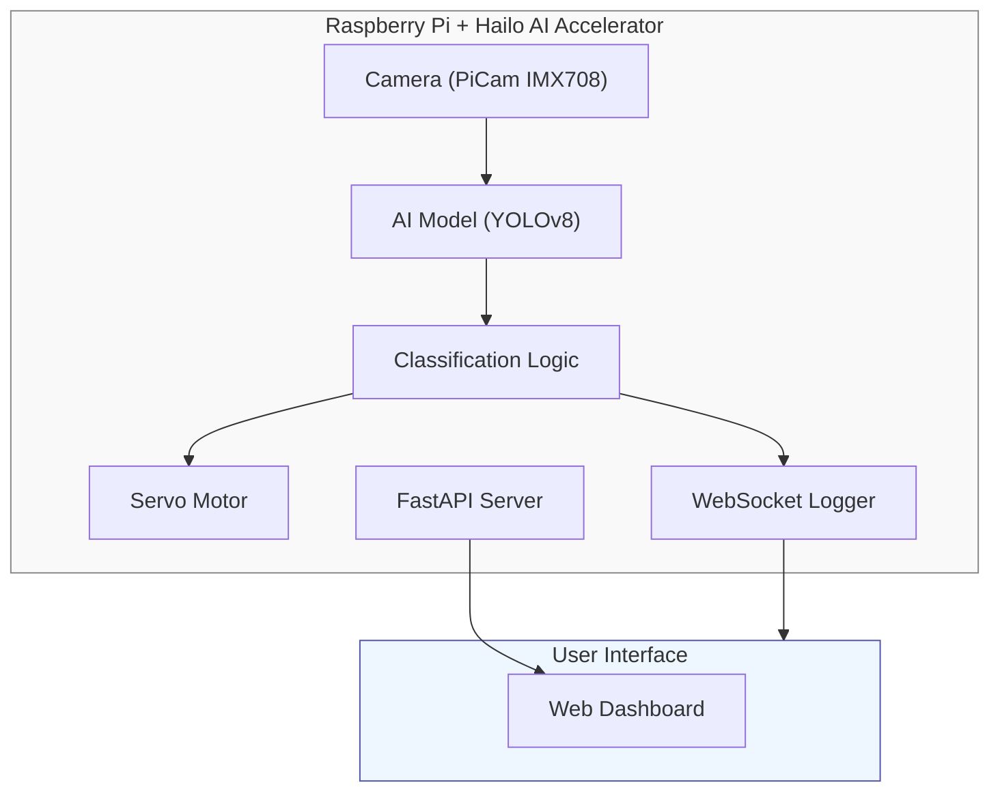

# Real-time Object Analysis, Classification, and Sorting System
A prototype system for real-time object detection, classification, and physical sorting using Raspberry Pi with Hailo AI accelerator.

## Project Goals
The goal is to **create a prototype system** that can:
- Analyze real-time camera feed
- Recognize and classify objects (e.g., apples, potatoes, packages)
- **Control hardware for physical sorting** based on classification (servo, actuators)
- **Record and visualize sorting data** through a web interface

The system is implemented on **Raspberry Pi** with an **AI accelerator** (Hailo AI Kit) and camera (IMX708).

## System Architecture
### Component Overview


### Data Flow
1. **Camera** captures objects in real-time
2. **AI model** performs detection and classification
3. **Decision logic** evaluates results and sends signals to servo
4. **Servo motor** physically sorts objects (e.g., right = good, left = defective)
5. **Logger** sends results (time, object type, outcome) via WebSocket and stores in database
6. **FastAPI server** provides web interface for statistics and live video

## Project Structure
```
PS_Project/    
├── api/                      # API and web interface
│   └── client_API.py         # FastAPI server (camera, servo, AI endpoints)
├── hardware/                 # Hardware control
│   └── ServoController.py    # Servo motor control via GPIO
├── pipeline/                 # AI processing pipeline
│   ├── HailoPipeline.py      # Hailo AI inference pipeline
│   └── mqtt_spy.py           # MQTT monitoring utility
│
├── Utils.py              # System utilities and UI components
├── RemoteUtils.py        # Remote deployment and management tools
│
├── tests/                             # Test scripts
│   ├── GStreamer_RTSP_stream_test.py  # RTSP stream testing
│   ├── OnboardCameraTest.py           # Camera functionality tests
│   ├── test.py                        # Main demo/ test script
│   └── test_gpio18.py                 # GPIO/servo testing
│
├── docs/                         # Documentation
│   └── NAVRH.md                  # Project proposal (Czech)
│
├── .gitignore                    # Git ignore rules
├── LICENSE                       # Project license
└── README.md                     # Project readme (English)             
```

## Team Roles
### 1. AI / Computer Vision Engineer
**Responsibilities:**
- Research detection and classification methods
- Collect and prepare datasets (object photos, annotations)
- Train and optimize model for Raspberry Pi (Hailo)
- Test model accuracy

**Technologies:**
- Python, PiCamera2, ONNX + Hailo, YOLOv8

### 2. Embedded & Hardware Engineer
**Responsibilities:**
- Configure Raspberry Pi (OS, camera, GPIO)
- Connect and program servo motors, sensors, and camera
- Implement communication logic between AI module and hardware
- Optimize for real-time operation (lower latency, higher FPS)

**Technologies:**
- Python (lgpio), Raspberry Pi OS, rpicam, Bash / Docker

### 3. Software & Data Visualization Developer
**Responsibilities:**
- Develop web interface (HTML/CSS/JavaScript)
- Implement REST API for classification results
- Store and visualize data (WebSocket, SQLite, PostgreSQL)
- Documentation and presentation of results

**Technologies:**
- Python, FastAPI, HTML/CSS/JavaScript, SQLite/PostgreSQL, Git, Markdown

## Key Features
### API Endpoints (client_API.py)
- **Servo Control**: `/servo/move` - Control servo position and speed
- **Camera Capture**: `/camera/stream/capture` - Take photos
- **Camera Stream**: `/camera/stream/snapshots` - MJPEG stream
- **AI Detection**: `/api/detections` - Get recent detections
- **Statistics**: `/api/statistics` - Aggregated traffic statistics
- **WebSocket**: `/ws/ai` - Real-time detection streaming
- **Health Check**: `/health/ai`, `/health/camera` - System status

### AI Pipeline (HailoPipeline.py)
- Supports RTSP and file sources
- Real-time object detection with YOLOv8
- Hailo AI accelerator integration
- Multiple output options (MQTT, local storage)
- Configurable video preprocessing

## Technology Stack
| Domain      | Technologies                              |
|-------------|-------------------------------------------|
| AI / ML     | ONNX, Hailo, YOLOv8, PiCamera2           |
| Embedded    | Raspberry Pi 5, GPIO (lgpio), IMX708 camera |
| Backend     | FastAPI, Python                           |
| Frontend    | HTML, CSS, JavaScript                     |
| Database    | SQLite / PostgreSQL                       |
| Other       | Git, Docker, Markdown, MQTT               |

## Development Timeline (Overview)
| Week  | Activity                                  |
|-------|-------------------------------------------|
| 1-2   | Research, architecture design             |
| 3-5   | Data collection, model training           |
| 6-7   | Software development (FastAPI, visualization) |
| 8-9   | Integration with Raspberry Pi and hardware |
| 10    | Testing and optimization                  |
| 11    | Documentation and presentation preparation |

## Testing and Evaluation
- **Functional tests** - Real-time object classification
- **Performance tests** - FPS measurement, latency, system response
- **Model accuracy** - Confusion Matrix, F1-score, classification accuracy
- **Sorting reliability** - Percentage of correctly sorted objects

## Deliverables
- Functional **prototype sorting device** with camera and servo
- **Web interface** for classification data visualization
- **Dataset + trained model**
- **Final report** and **technical documentation**

## Project Team
| Name     | Role                | Responsibility                        |
|----------|---------------------|---------------------------------------|
| Member 1 | AI Engineer         | Model development and data analysis   |
| Member 2 | Embedded Developer  | Raspberry Pi, servo, camera          |
| Member 3 | Software Developer  | Web, API, visualization, documentation |

## Contributing
This project was created as part of a university course demonstrating modern computer vision, machine learning, and embedded systems methods.