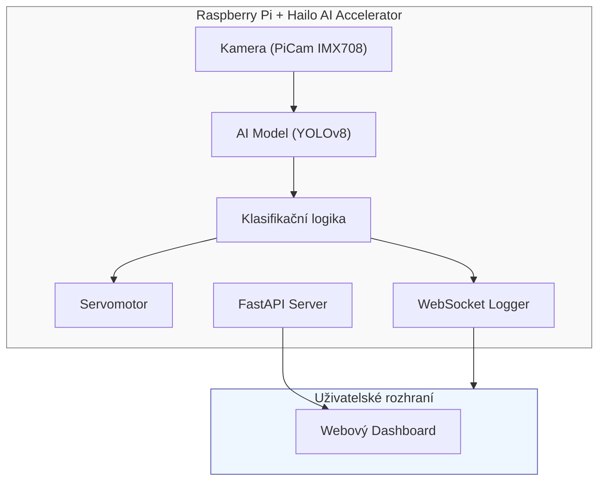

# Systém pro analýzu, klasifikaci a třídění objektů v reálném čase
Prototypový systém pro detekci objektů v reálném čase, klasifikaci a fyzické třídění pomocí Raspberry Pi s AI akcelerátorem Hailo.

## Cíle projektu
Cílem je **vytvořit prototypový systém**, který dokáže:
- Analyzovat video signál z kamery v reálném čase
- Rozpoznávat a klasifikovat objekty (např. jablka, brambory, balíčky)
- **Ovládat hardware pro fyzické třídění** na základě klasifikace (servo, aktuátory)
- **Zaznamenávat a vizualizovat data třídění** prostřednictvím webového rozhraní

Systém je implementován na **Raspberry Pi** s **AI akcelerátorem** (Hailo AI Kit) a kamerou (IMX708).

## Architektura systému
### Přehled komponent


### Tok dat
1. **Kamera** zachycuje objekty v reálném čase
2. **AI model** provádí detekci a klasifikaci
3. **Rozhodovací logika** vyhodnocuje výsledky a odesílá signály servu
4. **Servomotor** fyzicky třídí objekty (např. doprava = dobré, doleva = vadné)
5. **Logger** odesílá výsledky (čas, typ objektu, výsledek) přes WebSocket a ukládá do databáze
6. **FastAPI server** poskytuje webové rozhraní pro statistiky a živé video

## Struktura projektu
```
PS_Project/    
├── api/                      # API a webové rozhraní
│   └── client_API.py         # FastAPI server (kamera, servo, AI endpointy)
├── hardware/                 # Ovládání hardwaru
│   └── ServoController.py    # Ovládání servomotoru přes GPIO
├── pipeline/                 # Pipeline pro zpracování AI
│   ├── HailoPipeline.py      # Pipeline pro Hailo AI inferenci
│   └── mqtt_spy.py           # Nástroj pro monitoring MQTT
│
├── Utils.py              # Systémové utility a UI komponenty
├── RemoteUtils.py        # Nástroje pro vzdálené nasazení a správu
│
├── tests/                             # Testovací skripty
│   ├── GStreamer_RTSP_stream_test.py  # Testování RTSP streamu
│   ├── OnboardCameraTest.py           # Testy funkcionality kamery
│   ├── test.py                        # Hlavní demo/testovací skript
│   └── test_gpio18.py                 # Testování GPIO/serva
│
├── docs/                         # Dokumentace
│   └── NAVRH.md                  # Návrh projektu (česky)
│
├── .gitignore                    # Pravidla pro Git ignore
├── LICENSE                       # Licence projektu
└── README.md                     # Projekt readme (anglicky)             
```

## Role v týmu
### 1. AI / Inženýr počítačového vidění
**Odpovědnosti:**
- Výzkum metod detekce a klasifikace
- Sběr a příprava datových sad (fotky objektů, anotace)
- Trénování a optimalizace modelu pro Raspberry Pi (Hailo)
- Testování přesnosti modelu

**Technologie:**
- Python, PiCamera2, ONNX + Hailo, YOLOv8

### 2. Embedded & Hardwarový inženýr
**Odpovědnosti:**
- Konfigurace Raspberry Pi (OS, kamera, GPIO)
- Připojení a programování servomotorů, senzorů a kamery
- Implementace komunikační logiky mezi AI modulem a hardwarem
- Optimalizace pro provoz v reálném čase (nižší latence, vyšší FPS)

**Technologie:**
- Python (lgpio), Raspberry Pi OS, rpicam, Bash / Docker

### 3. Softwarový vývojář & Vizualizace dat
**Odpovědnosti:**
- Vývoj webového rozhraní (HTML/CSS/JavaScript)
- Implementace REST API pro výsledky klasifikace
- Ukládání a vizualizace dat (WebSocket, SQLite, PostgreSQL)
- Dokumentace a prezentace výsledků

**Technologie:**
- Python, FastAPI, HTML/CSS/JavaScript, SQLite/PostgreSQL, Git, Markdown

## Klíčové funkce
### API Endpointy (client_API.py)
- **Ovládání serva**: `/servo/move` - Ovládání polohy a rychlosti serva
- **Snímání kamerou**: `/camera/stream/capture` - Pořízení fotografií
- **Stream z kamery**: `/camera/stream/snapshots` - MJPEG stream
- **AI Detekce**: `/api/detections` - Získání nedávných detekcí
- **Statistiky**: `/api/statistics` - Agregované statistiky provozu
- **WebSocket**: `/ws/ai` - Streamování detekcí v reálném čase
- **Kontrola stavu**: `/health/ai`, `/health/camera` - Stav systému

### AI Pipeline (HailoPipeline.py)
- Podpora RTSP a souborových zdrojů
- Detekce objektů v reálném čase pomocí YOLOv8
- Integrace s AI akcelerátorem Hailo
- Více možností výstupu (MQTT, lokální úložiště)
- Konfigurovatelné předzpracování videa

## Technologický stack
| Oblast      | Technologie                               |
|-------------|-------------------------------------------|
| AI / ML     | ONNX, Hailo, YOLOv8, PiCamera2           |
| Embedded    | Raspberry Pi 5, GPIO (lgpio), IMX708 kamera |
| Backend     | FastAPI, Python                           |
| Frontend    | HTML, CSS, JavaScript                     |
| Databáze    | SQLite / PostgreSQL                       |
| Ostatní     | Git, Docker, Markdown, MQTT               |

## Harmonogram vývoje (Přehled)
| Týden | Aktivita                                  |
|-------|-------------------------------------------|
| 1-2   | Výzkum, návrh architektury                |
| 3-5   | Sběr dat, trénování modelu                |
| 6-7   | Vývoj softwaru (FastAPI, vizualizace)     |
| 8-9   | Integrace s Raspberry Pi a hardwarem      |
| 10    | Testování a optimalizace                  |
| 11    | Dokumentace a příprava prezentace         |

## Testování a vyhodnocení
- **Funkční testy** - Klasifikace objektů v reálném čase
- **Výkonnostní testy** - Měření FPS, latence, odezvy systému
- **Přesnost modelu** - Confusion Matrix, F1-score, přesnost klasifikace
- **Spolehlivost třídění** - Procento správně roztříděných objektů

## Výstupy projektu
- Funkční **prototyp třídícího zařízení** s kamerou a servem
- **Webové rozhraní** pro vizualizaci klasifikačních dat
- **Datová sada + natrénovaný model**
- **Závěrečná zpráva** a **technická dokumentace**

## Projektový tým
| Jméno    | Role                | Odpovědnost                           |
|----------|---------------------|---------------------------------------|
| Člen 1   | AI Inženýr          | Vývoj modelu a analýza dat            |
| Člen 2   | Embedded vývojář    | Raspberry Pi, servo, kamera           |
| Člen 3   | Softwarový vývojář  | Web, API, vizualizace, dokumentace    |

## Přispívání
Tento projekt byl vytvořen v rámci univerzitního kurzu demonstrující moderní metody počítačového vidění, strojového učení a vestavěných systémů.