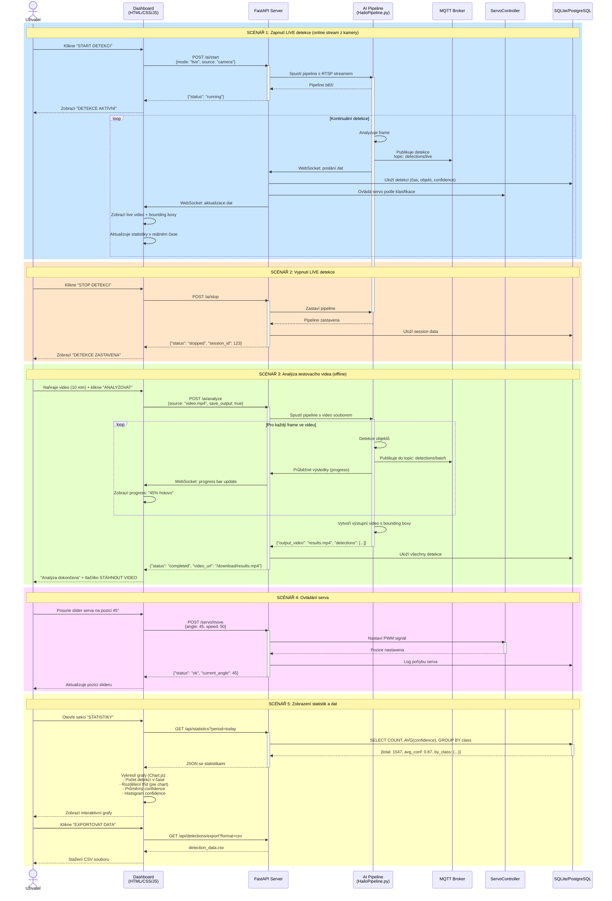

```mermaid
sequenceDiagram
    actor User as Uživatel
    participant UI as Dashboard<br/>(HTML/CSS/JS)
    participant API as FastAPI Server
    participant Pipeline as AI Pipeline<br/>(HailoPipeline.py)
    participant MQTT as MQTT Broker
    participant Servo as ServoController
    participant DB as SQLite/PostgreSQL
    
    rect rgb(200, 230, 255)
        Note over User,DB: SCÉNÁŘ 1: Zapnutí LIVE detekce (online stream z kamery)
        User->>UI: Klikne "START DETEKCI"
        UI->>API: POST /ai/start<br/>{mode: "live", source: "camera"}
        activate API
        API->>Pipeline: Spustí pipeline s RTSP streamem
        activate Pipeline
        Pipeline-->>API: Pipeline běží
        API-->>UI: {"status": "running"}
        deactivate API
        UI-->>User: Zobrazí "DETEKCE AKTIVNÍ"
        
        loop Kontinuální detekce
            Pipeline->>Pipeline: Analyzuje frame
            Pipeline->>MQTT: Publikuje detekce<br/>topic: detections/live
            Pipeline->>API: WebSocket: poslání dat
            API->>DB: Uloží detekci (čas, objekt, confidence)
            API->>Servo: Ovládá servo podle klasifikace
            API->>UI: WebSocket: aktualizace dat
            UI->>UI: Zobrazí live video + bounding boxy
            UI->>UI: Aktualizuje statistiky v reálném čase
        end
    end
    
    rect rgb(255, 230, 200)
        Note over User,DB: SCÉNÁŘ 2: Vypnutí LIVE detekce
        User->>UI: Klikne "STOP DETEKCI"
        UI->>API: POST /ai/stop
        activate API
        API->>Pipeline: Zastaví pipeline
        deactivate Pipeline
        Pipeline-->>API: Pipeline zastavena
        API->>DB: Uloží session data
        API-->>UI: {"status": "stopped", "session_id": 123}
        deactivate API
        UI-->>User: Zobrazí "DETEKCE ZASTAVENA"
    end
    
    rect rgb(230, 255, 200)
        Note over User,DB: SCÉNÁŘ 3: Analýza testovacího videa (offline)
        User->>UI: Nahraje video (10 min) + klikne "ANALYZOVAT"
        UI->>API: POST /ai/analyze<br/>{source: "video.mp4", save_output: true}
        activate API
        API->>Pipeline: Spustí pipeline s video souborem
        activate Pipeline
        
        loop Pro každý frame ve videu
            Pipeline->>Pipeline: Detekce objektů
            Pipeline->>MQTT: Publikuje do topic: detections/batch
            Pipeline->>API: Průběžné výsledky (progress)
            API->>UI: WebSocket: progress bar update
            UI->>UI: Zobrazí progress: "45% hotovo"
        end
        
        Pipeline->>Pipeline: Vytvoří výstupní video s bounding boxy
        Pipeline-->>API: {"output_video": "results.mp4", "detections": [...]}
        deactivate Pipeline
        API->>DB: Uloží všechny detekce
        API-->>UI: {"status": "completed", "video_url": "/download/results.mp4"}
        deactivate API
        UI-->>User: "Analýza dokončena" + tlačítko STÁHNOUT VIDEO
    end
    
    rect rgb(255, 220, 255)
        Note over User,DB: SCÉNÁŘ 4: Ovládání serva
        User->>UI: Posune slider serva na pozici 45°
        UI->>API: POST /servo/move<br/>{angle: 45, speed: 50}
        activate API
        API->>Servo: Nastaví PWM signál
        activate Servo
        Servo-->>API: Pozice nastavena
        deactivate Servo
        API->>DB: Log pohybu serva
        API-->>UI: {"status": "ok", "current_angle": 45}
        deactivate API
        UI-->>User: Aktualizuje pozici slideru
    end
    
    rect rgb(255, 255, 200)
        Note over User,DB: SCÉNÁŘ 5: Zobrazení statistik a dat
        User->>UI: Otevře sekci "STATISTIKY"
        UI->>API: GET /api/statistics?period=today
        activate API
        API->>DB: SELECT COUNT, AVG(confidence), GROUP BY class
        activate DB
        DB-->>API: {total: 1547, avg_conf: 0.87, by_class: {...}}
        deactivate DB
        API-->>UI: JSON se statistikami
        deactivate API
        UI->>UI: Vykreslí grafy (Chart.js):<br/>- Počet detekcí v čase<br/>- Rozdělení tříd (pie chart)<br/>- Průměrný confidence<br/>- Histogram confidence
        UI-->>User: Zobrazí interaktivní grafy
        
        User->>UI: Klikne "EXPORTOVAT DATA"
        UI->>API: GET /api/detections/export?format=csv
        API-->>UI: detection_data.csv
        UI-->>User: Stažení CSV souboru
    end
```